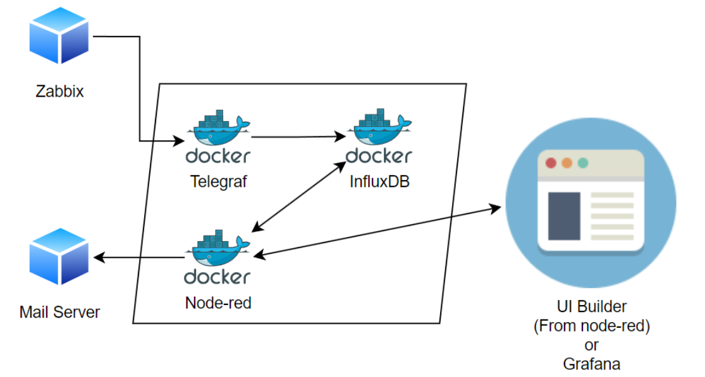

<a id="readme-top"></a>
<div align="center">
    <h2 style="text-align: center;">DevOps Internship Project</h2>
</div>


<!-- Table of Contents -->
<details>
  <summary>Table of Contents</summary>
  <ol>
    <li>
      <a href="#about-the-project">About The Project</a>
      <ul>
        <li><a href="#built-with">Built With</a></li>
      </ul>
    </li>
      <br>
    <li>
      <a href="#getting-started">Getting Started</a>
      <ul>
        <li><a href="#prerequisites">Prerequisites</a></li>
        <li><a href="#installation">Installation</a></li>
        <li><a href="#basic-commands">Basic Commands</a></li>
        <li><a href="#uninstallation">Uninstallation</a></li>
      </ul>
    </li>
      <br>
    <li>
      <a href="#accessing-services">Accessing Services</a>
      <ul>
        <li><a href="#default-credentials">Default Credentials</a></li>
      </ul>
    </li>
      <br>
    <li>
      <a href="#customization">Customization</a>
      <ul>
        <li><a href="#env-file">.env File</a></li>
        <li><a href="#telegraf-configuration">Telegraf Configuration</a></li>
        <li><a href="#postman-setup-and-usage">Postman Setup and Usage</a>
          <ul>
            <li><a href="#installing-postman">Installing Postman</a></li>
            <li><a href="#importing-the-postman-collection">Importing the Postman Collection</a></li>
          </ul>
        </li>
        <li><a href="#grafana-dashboards-and-data-sources">Grafana Dashboards and Data Sources</a></li>
        <li><a href="#zabbix-configuration">Zabbix Configuration</a></li>
        <li><a href="#node-red-flows">Node-RED Flows</a></li>
      </ul>
    </li>
      <br>
    <li>
      <a href="#overview-of-node-red-endpoints">Overview of Node-RED Endpoints</a>
      <ul>
        <li><a href="#get-ping">GET /ping</a></li>
        <li><a href="#inject-e-mail">Inject E-mail</a></li>
        <li><a href="#get-status">GET /status</a></li>
        <li><a href="#get-config-toml">GET /config TOML</a></li>
      </ul>
    </li>
      <br>
    <li>
      <a href="#overview-of-the-telegram-api-endpoints">Overview of the Telegram API Endpoints</a>
      <ul>
        <li><a href="#get-config">GET /config</a></li>
        <li><a href="#put-config">PUT /config</a></li>
        <li><a href="#get-restart">GET /restart</a></li>
      </ul>
    </li>
  </ol>
</details>
<br>


### About The Project
This project sets up a comprehensive monitoring and data management system using **Docker**. It integrates:

- **InfluxDB:** For time-series data storage
- **Grafana:** For data visualization
- **Node-RED:** For flow-based programming and API endpoints
- **Telegraf:** For metrics collection and reporting
- **Zabbix:** For enterprise-class monitoring
- **Flask:** API for managing Telegraf configurations
- **Postman:** For testing Flask API endpoints
  
The system collects, stores, visualizes, and monitors various metrics and logs, offering a complete solution for system and application monitoring.

<br />
<div align="center">
    
</div>
<p align="right">(<a href="#readme-top">back to top</a>)</p>
<br>


#### Built With
* [![InfluxDB][InfluxDB]][InfluxDB-url] 
* [![Grafana][Grafana]][Grafana-url] 
* [![Node-RED][Node-RED]][Node-RED-url] 
* [![Telegraf][Telegraf]][Telegraf-url] 
* [![Zabbix][Zabbix]][Zabbix-url] 
* [![Docker Desktop][Docker]][Docker-url]
* [![Flask][Flask]][Flask-url]
* [![Postman][Postman]][Postman-url]

<p align="right">(<a href="#readme-top">back to top</a>)</p>
<br><br><br>


### Getting Started
This is an example of how you may give instructions on setting up your project locally.
To get a local copy up and running follow these simple example steps.
<br>


#### Prerequisites
To get this project running, you'll need to download **Docker Desktop:**
<ul>
  <li><strong>Mac:</strong> <a href="https://docs.docker.com/desktop/install/mac-install/">Docker Desktop on Mac</a></li>
  <li><strong>Windows:</strong> <a href="https://docs.docker.com/desktop/install/windows-install/">Docker Desktop on Windows</a></li>
  <li><strong>Linux:</strong> <a href="https://docs.docker.com/desktop/install/linux-install/">Docker Desktop on Linux</a></li>
</ul>
  
<p align="right">(<a href="#readme-top">back to top</a>)</p>
<br>


#### Installation
- To start the project, simply run the following command in your terminal:
```
docker-compose up -d
```
<p align="right">(<a href="#readme-top">back to top</a>)</p>
<br>


#### Basic Commands 
Here are some basic Docker commands to manage your project:
- View logs:
```
docker logs [container_name_or_id]
```
<br>

- Execute commands in a running container:
```
docker exec -it [container_name_or_id] /bin/bash
```
<br>

- To list all containers (including stopped ones):
```
docker ps -a
```
**Check container health:** Use the healthcheck section in docker-compose.yml for detailed health information.
<p align="right">(<a href="#readme-top">back to top</a>)</p>
<br>


#### Uninstallation
- To stop and remove all containers, networks, and volumes created by docker-compose up -d:
```
docker-compose down
```
<p align="right">(<a href="#readme-top">back to top</a>)</p>
<br><br><br>


### Accessing Services
After starting the project, you can access the services at:

- **InfluxDB:** `http://your-ip-address:8086` or `http://localhost:8086`
- **Grafana:** `http://your-ip-address:3000` or `http://localhost:3000`
- **Node-RED:** `http://your-ip-address:1880` or `http://localhost:1880`
- **Zabbix:** `http://your-ip-address:8080` or `http://localhost:8080`
  
**Note:** If you are accessing the services locally on the same machine where they are running, you can use **`localhost`** instead of **`your-ip-address`**. However, if you need to access the services from another device or over a network, use the IP address of the machine where the services are hosted.


<p align="right">(<a href="#readme-top">back to top</a>)</p>
<br>


#### Default Credentials
Here are the default usernames and passwords for the services:

| **Service** | **Username** | **Password** |
|---|---|---|
| InfluxDB | admin (set in .env File) | admin (set in .env File) |
| Grafana | admin | admin |
| Zabbix | Admin | zabbix |
| PostgreSQL (for Zabbix) | zabbix (set in .env File) | zabbix (set in .env File)|

<br>

**Node-RED:** 
- No default credentials, set up on first access. 

- In the **`settings.js`** file located inside the **`./data/node-red`** folder, the **`adminAuth`** section contains the password in a **`bcrypt-hashed format`**.
  - **What is a bcrypt-hashed password?**
    - <p>Bcrypt is a password hashing function designed to be computationally expensive to deter brute-force attacks. A bcrypt-hashed password is a password that has been transformed into a fixed-length string using the bcrypt algorithm. This transformation makes it more secure to store and verify passwords.</p>
    - You can also find more detailed information on securing Node-RED with bcrypt in the <a href="https://nodered.org/docs/user-guide/runtime/securing-node-red" target="_blank">Node-RED official documentation.</a>
```
adminAuth: {
           type: "credentials",
           users: [{
               username: "admin",
               password: "$2a$12$bG1uWqAK7hyiTrHONTZ7Bur1ixLmafol/m6ykQMJQ6Ifl57Pja2XK",
               permissions: "*"
           }]
        }
```
<ul>
<li>You can generate a bcrypt-hashed password using any <a href="https://bcrypt-generator.com/" target="_blank">bcrypt generator.</a></li>
</ul>

- After creating the password, stop the project, update the settings file with the hashed password, and then restart the project.

<p align="right">(<a href="#readme-top">back to top</a>)</p>
<br><br><br>


### Customization

#### .env File
This project includes an **`.env-example`** file for service configuration. This file serves as a template for customizing your project. Before starting to use the project, follow these steps:
- 1-) Copy the **`.env-example`** file to a new file named **`.env`**.
- 2-) Open the newly created .env file and modify the values according to your needs. This file contains the necessary configuration settings for each service.
- 3-) Make sure to replace passwords, tokens, and other sensitive information with **`your own secure values`**.
  <br>
  
  - **Versions:** Specify the versions for each service (InfluxDB, Grafana, Node-RED, PostgreSQL, Zabbix).
  - **Time Zone:** Set the time zone for Grafana, Node-RED, and InfluxDB.
  - **InfluxDB:** Configure initial settings for InfluxDB, including username, password, organization, bucket, and admin token.
  - **PostgreSQL & Zabbix:** Set database credentials and frontend port for Zabbix.

After completing these steps, you can start your project with your customized settings using the docker-compose command.

**`Remember:`** The .env file may contain sensitive information, so never add this file to version control or share it. The .env-example file is provided as a template with non-secure example values.

<p align="right">(<a href="#readme-top">back to top</a>)</p>
<br>


#### Telegraf Configuration
- To customize Telegraf settings, modify the **`telegraf.conf`** file located in the **`./data/telegraf/`** directory.
  
- You can adjust input, output, and processor **`plugins`** as needed.
  - **What is a plugin?**
    - <p> A plugin is a component that adds specific capabilities to a larger software application. In the context of Telegraf, plugins extend its functionality by enabling it to collect data (input plugins) from various sources and send data (output plugins) to different destinations, such as databases, monitoring systems, and more.
    - For more information on available Telegraf plugins, you can visit the <a 
    href="https://github.com/influxdata/telegraf/tree/master/plugins">Telegraf Input and Output Plugins 
    documentation on GitHub</a> or the <a href="https://docs.influxdata.com/telegraf/v1/plugins/">official 
    Telegraf Plugins documentation</a> on the InfluxData website.
    </p>

<p align="right">(<a href="#readme-top">back to top</a>)</p>
<br>


#### Postman Setup and Usage
Postman is a powerful tool for API development, testing, and automation. It allows you to easily send HTTP requests to your APIs and inspect the responses.

##### Installing Postman
- **`For Windows:`**
  - 1-) Download the installer from the [official Postman website](https://www.postman.com/downloads/).
  - 2-) Run the installer and follow the on-screen instructions to complete the installation.
    
- **`For macOS:`**
  - 1-) Download the .dmg file from the [official Postman website](https://www.postman.com/downloads/).
  - 2-) Open the .dmg file and drag the Postman app into your Applications folder.

- **`For Linux:`**
  - 1-) Download the appropriate package for your distribution from the [official Postman website] 
    (https://www.postman.com/downloads/).
  - 2-) Follow the instructions provided for your specific Linux distribution to install the app.

<p align="right">(<a href="#readme-top">back to top</a>)</p>
<br>


##### Importing the Postman Collection
1. **Locate the Collection:**
   - The Postman collection file is located at **`./data/custom/postman/telegraf_api_collection.json`**.

2. **Importing the Collection:**
   - Open Postman.
   - Click on **`Import`** in the top-left corner.
   - Select "Upload Files" and navigate to **`telegraf_api_collection.json`**` to find the collection file.
   - Click "Open" to import the collection.

3. **Using the Collection:**
   - Once imported, the collection will appear in your **`Postman sidebar`**.
   - Expand the collection to see all the available endpoints.
   - Click on any endpoint to view its details and send a request.

Notes:
- Ensure that the Flask service running the **`Telegraf API is active and accessible`**.
- You can modify the requests as needed within Postman, such as updating the URL if the service is hosted on a **`different address or port`**.
- This collection allows you to manage Telegraf's configuration, restart the service, and check the current version with ease.

<p align="right">(<a href="#readme-top">back to top</a>)</p>
<br>


#### Grafana Dashboards and Data Sources
- For Grafana, you can **`create and modify dashboards`**, **`data sources`**, and **`alerts`** through the web interface.
  - To explore and use pre-made dashboards for InfluxDB, visit the [Grafana Dashboards for InfluxDB](https://grafana.com/grafana/dashboards/?search=Influxdb) page. Here, you can find various dashboards that you can import into your Grafana instance to visualize InfluxDB data effectively. This page provides a wide range of dashboard templates that can be customized to fit your monitoring needs.
    
- Alternatively, you can automate the setup by placing JSON configuration files in the **`./data/grafana/provisioning/`** directory.
  
<p align="right">(<a href="#readme-top">back to top</a>)</p>
<br>


#### Zabbix Configuration
To configure a host according to the docker-compose.yml file:
- 1-) Log in to the Zabbix web interface.
- 2-) Navigate to **`Data collection`** in the left menu.
- 3-) Select the **`Hosts`** tab.

  <div align="center">
    
</div>

- 4-) Instead of creating a new host, locate and edit the existing host named zabbix-agent (created automatically by the docker-compose.yml file).

- 5-) Adjust the following settings as needed:
  - Host name: **`zabbix-agent`**
  - Templates: **`Linux by Zabbix agent`**, **`Zabbix server health`**
  - Host groups: **`Zabbix servers`**
    
    - Interfaces:
      - Type: **`Agent`**
      - IP address: your-ip-address or 127.0.0.1 (localhost)
      - DNS name: **`zabbix-agent`**
      - Connect to: **`DNS`**
      - Port: **`10050`** (default Zabbix agent port)
        
- 6-) Click Update to save any changes.
    
<div align="center">
    
</div>
<br>

For further details on host configuration, refer to the <a href="https://www.zabbix.com/documentation/current/en/manual/config/hosts/host" target="_blank">Zabbix documentation</a>.

<p align="right">(<a href="#readme-top">back to top</a>)</p>
<br>


#### Node-RED Flows
**To view and manage these flows:**
  - 1-) Access the Node-RED interface at **http://your-ip-address:1880** or **http://localhost:1880**.
  - 2-) To install the **`node-red-node-email`** package, go to the Node-RED web interface, navigate to **`Manage Palette`** under the **`Install tab`**.
  - 3-) Import the flow file located at **`./data/custom/flows/flows.json`** if not already loaded.
  - 4-) Deploy the flows.

<br />
<div align="center">
    
</div>

<p align="right">(<a href="#readme-top">back to top</a>)</p>
<br><br><br>


### Overview of Node-RED Endpoints

#### GET /ping
This endpoint tests the connection between Node-RED and InfluxDB.

- **Functionality**: Queries InfluxDB for ping measurements over the last minute
- **Purpose**: Verifies that Node-RED can successfully connect to and retrieve data from InfluxDB
- **Response**: Returns a JSON array containing average response times and corresponding URLs
- **Use Case**: Monitoring network performance, latency, and InfluxDB connectivity

**Usage:**
Access **`http://your-ip-address:1880/ping`** or **`http://localhost:1880/ping`** in your web browser or send a GET request to this URL.
If successful, InfluxDB will respond with data, confirming that:
1. Node-RED can connect to InfluxDB
2. InfluxDB is operational and can execute queries
3. The specified data (ping measurements) exists in the database

<br />
<div align="center">
    
</div>

<p align="right">(<a href="#readme-top">back to top</a>)</p>
<br>


#### Inject E-mail
This is not an HTTP endpoint, but a manually triggered action within Node-RED.

- **Functionality**: Sends a test email
- **Configuration**: Uses Gmail SMTP server
- **Use Case**: Testing email notifications or sending periodic reports

**Usage:**
Manually triggered by clicking the "inject" node in the Node-RED flow. As it's not a real endpoint, it cannot be directly called by external systems.

<br />
<div align="center">
    
</div>

<p align="right">(<a href="#readme-top">back to top</a>)</p>
<br>


#### GET /status
This endpoint checks the health status of multiple services.

- **Functionality**: Performs health checks on InfluxDB, Zabbix, Grafana, and Telegraf
- **Response**: Returns a JSON object with the status of each service
- **Error Handling**: Sends an email notification if any service is not working properly
- **Use Case**: Monitoring the overall health of the system components

**Usage:**
Access **`http://your-ip-address:1880/status`** or **`http://localhost:1880/status`** in your web browser or send a GET request to this URL.

The response includes the name and version number of each service. If a service is not working, it will display "Our manager has been informed!" and send an email to the system administrator.

<br />
<div align="center">
    
</div>

<p align="right">(<a href="#readme-top">back to top</a>)</p>
<br>


#### GET /config TOML
This endpoint retrieves the Telegraf configuration.

- **Functionality**: Fetches the Telegraf configuration file
- **Response**: Returns the configuration in TOML format
- **Content-Type**: text/plain
- **Use Case**: Allowing remote inspection or verification of Telegraf settings

**Usage:**
Access **`http://your-ip-address:1880/config`** or **`http://localhost:1880/config`** in your web browser or send a GET request to this URL.

The response contains the current configuration of Telegraf in TOML format. This allows system administrators or developers to remotely check Telegraf settings and troubleshoot if necessary.

Each of these endpoints plays a crucial role in monitoring and maintaining the health and configuration of our system components.

<br />
<div align="center">
    
</div>

<p align="right">(<a href="#readme-top">back to top</a>)</p>
<br><br><br>


### Overview of the Telegram API Endpoints

#### GET /config
This document explains the available API endpoints for managing Telegraf through the Flask-based service.

- **Method**: GET
- **URL**: **`http://localhost:1880/config`**
- **Response**: 
  - Success: Returns the content of the Telegraf configuration file as plain text with a 200 status code.
  - Error: Returns a JSON object with an error message and a 500 status code.
Example usage: **http://localhost:5000/config**

<p align="right">(<a href="#readme-top">back to top</a>)</p>
<br>

#### PUT /config
This endpoint updates the Telegraf configuration and restarts the service.

- **Method**: PUT
- **URL**: `/config`
- **Request Body**: The new configuration content as plain text
- **Response**:
  - Success: Returns a success message with a 200 status code if the configuration is updated and Telegraf is restarted successfully.
  - Partial Success: Returns a message with a 500 status code if the configuration is updated but Telegraf fails to restart.
  - Error: Returns a JSON object with an error message and a 500 status code.
Example usage: **http://localhost:5000/config**

<p align="right">(<a href="#readme-top">back to top</a>)</p>
<br>

#### GET /restart
This endpoint restarts the Telegraf service.

- **Method**: GET
- **URL**: `/restart`
- **Response**:
  - Success: Returns a success message with a 200 status code if Telegraf is restarted successfully.
  - Error: Returns an error message with a 500 status code if the restart fails.
Example usage: **http://localhost:5000/restart**

<p align="right">(<a href="#readme-top">back to top</a>)</p>
<br>


<!-- Built With -->

[InfluxDB]: https://img.shields.io/badge/InfluxDB-%23C51162?style=for-the-badge&logo=influxdb&logoColor=white
[InfluxDB-url]: https://www.influxdata.com/

[Grafana]: https://img.shields.io/badge/Grafana-F5F5F5?style=for-the-badge&logo=grafana&logoColor=FF6600
[Grafana-url]: https://grafana.com/

[Node-RED]: https://img.shields.io/badge/Node--RED-%23730000?style=for-the-badge&logo=nodered&logoColor=white
[Node-RED-url]: https://nodered.org/

[Telegraf]: https://img.shields.io/badge/Telegraf-000000?style=for-the-badge&logo=telegraf&logoColor=white
[Telegraf-url]: https://www.influxdata.com/time-series-platform/telegraf/

[Zabbix]: https://img.shields.io/badge/Zabbix-%23D10000?style=for-the-badge&logo=zabbix&logoColor=white
[Zabbix-url]: https://www.zabbix.com/

[Docker]: https://img.shields.io/badge/Docker%20Desktop-%23007acc?style=for-the-badge&logo=docker&logoColor=white
[Docker-url]: https://www.docker.com/products/docker-desktop

[Flask]: https://img.shields.io/badge/Flask-%233A6A9A?style=for-the-badge&logo=flask&logoColor=white
[Flask-url]: https://flask.palletsprojects.com/

[Postman]: https://img.shields.io/badge/Postman-%23FF5722?style=for-the-badge&logo=postman&logoColor=white
[Postman-url]: https://www.postman.com/
